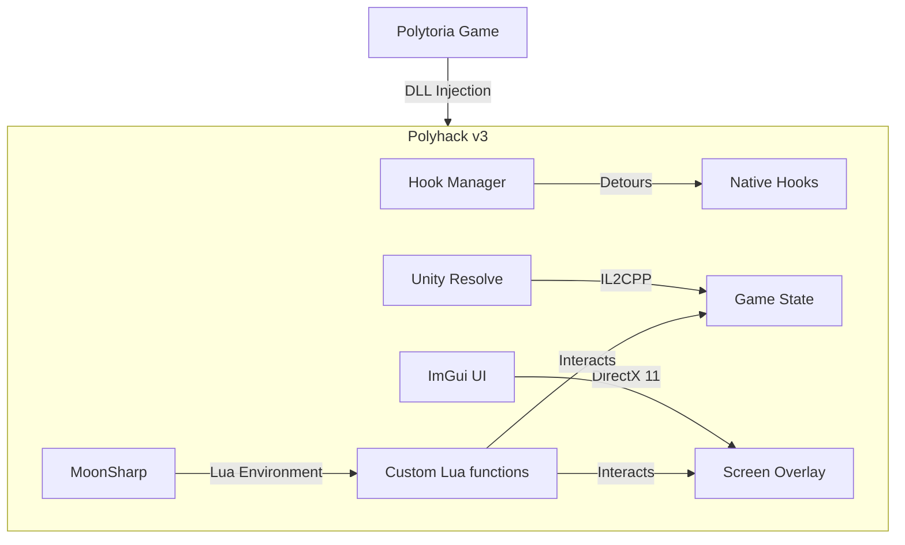
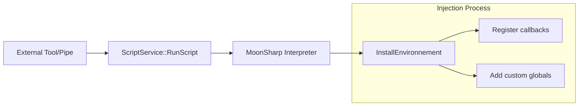
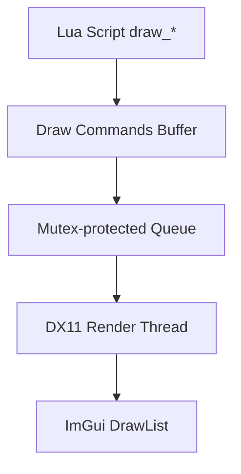
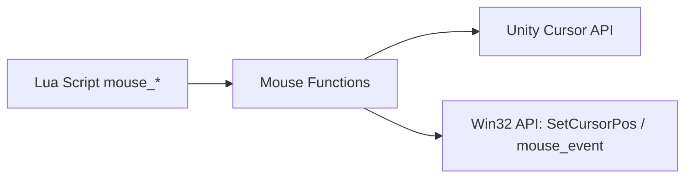

# Architecture Overview :material-file-tree:

This document provides a deep dive into the **Polytoria Executor** architecture, outlining the injection life-cycle, threading models, and core security mechanisms.

## :material-layers: System Overview

The executor is built as a **C++23 Shared Library (DLL)** that targets the Polytoria game process. It uses a combination of memory hooking and IL2CPP reflection to provide its feature set.

---

### :material-schema: Component Diagram



## :material-timer: Initialization Sequence

The initialization sequence is critical. Any modification to this flow can result in instability or crashes due to the nature of IL2CPP and threading.

!!! danger "Initialization Order"
    The order below must be strictly followed. Native Unity calls will crash if the thread is not attached to the GC.

1.  **OpenConsole()** - Attach a debug console for logging.
2.  **Wait for GameAssembly.dll** - IL2CPP runtime requires this DLL to be fully loaded.
3.  **Unity::Init()** - Initialize the reflection engine.
4.  **Unity::ThreadAttach()** - Attach the current thread to Unity GC.
5.  **Get Assembly-CSharp** - Establish the link to main game logic.
6.  **Wait for Game Singleton** - Game must reach a "Ready" state.
7.  **ScriptService::InstallHooks()** - Begin intercepting Lua execution.
8.  **UI::Setup()** - Hook DX11 `Present()` and start rendering.

---

## :material-source-branch: Threading Model

The executor operates across multiple threads to ensure performance and thread safety.

### Main Thread (Bootstrap)
The initial thread created by the injector. It handles the bootstrap and then exits.

### DX11 Render Thread
The primary game thread that invokes `Present()`. 
- **Responsibilities**: ImGui logic and the `DrawingLib` render loop.

### Pipe Server Thread
A background thread that monitors `\\.\pipe\wowiezz_pipe`.
- **Note**: This thread does **not** have direct IL2CPP access to prevent race conditions. It queues requests for the main game thread.

---

## :material-security: Whitelist Security

To prevent unauthorized code execution and minimize the risk to the game environment, the executor implements a secure **Whitelist System**.

!!! success "Whitelist Methodology"
    1.  Maintain a `std::vector` of whitelisted `BaseScript` pointers.
    2.  Hook `ExecuteScriptInstance`.
    3.  Compare the current instance pointer against the whitelist.
    4.  Only inject the custom environment if the pointer is verified.

```cpp
// Verification check
if (std::find(whitelisted.begin(), whitelisted.end(), instance) == whitelisted.end()) {
    return HookManager::Call(ExecuteScriptInstanceHook, self, script, instance);
}
```


## Component Interactions

### Script Execution Flow



### Drawing Flow



### Mouse Control Flow




## Memory Layout

### Key Global Objects

| Object | Type | Purpose |
|--------|------|---------|
| `ScriptService::whitelisted` | `std::vector<BaseScript*>` | Whitelisted scripts |
| `DrawingLib::commands` | `std::vector<DrawCommand>` | Pending draw commands |
| `DrawingLib::commandMutex` | `std::mutex` | Thread synchronization |

### IL2CPP Objects

Game objects are accessed via IL2CPP reflection:
- All objects are garbage collected
- References can become invalid between frames
- Must call `Unity::ThreadAttach()` on new threads

## Build System

The project uses [xmake](https://xmake.io/) as its build system:

```bash
# Debug build
xmake config -m debug
xmake build

# Release build  
xmake config -m release
xmake build
```

### Build Targets

| Target | Output | Purpose |
|--------|--------|---------|
| `wowiezz.dll` | Main DLL | Core executor |
| `injector.exe` | Executable | DLL injector |
| `version.dll` | DLL | HWID spoofer |

## Error Handling

The executor uses [`nasec::Assert()`](nasec/assert.h) for critical error handling:

```cpp
// Example: Assert with stack trace
nasec::Assert(method != nullptr, "Failed to get method for hooking");
```

Features:
- Stack traces via `StackWalk64`
- File and line information
- Halts execution on failure
