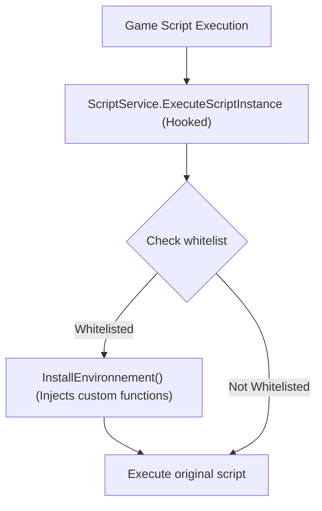

# Internals Documentation

This section provides in-depth documentation about the Polytoria Executor's internal architecture, how it integrates with the game, and how to extend its functionality.

## Overview

The executor is built on several key systems that work together to provide its functionality:

1. **IL2CPP Integration** - Interacts with Unity's IL2CPP runtime
2. **Hooking System** - Uses Microsoft Detours for function interception
3. **MoonSharp Bridge** - Connects C++ to Lua scripting
4. **ImGui Rendering** - Provides the overlay UI
5. **Network Interception** - Captures and modifies network traffic

## Core Components

### Source Code Organization

| Directory | Purpose |
|-----------|---------|
| [`cheat/`](../cheat/) | Main entry point, pipe server |
| [`ptoria/`](../ptoria/) | Game type bindings, script functions |
| [`moonsharp/`](../moonsharp/) | Lua interpreter interface |
| [`unity/`](../unity/) | IL2CPP reflection API |
| [`hooking/`](../hooking/) | Function hooking (Detours) |
| [`mirror/`](../mirror/) | Network interception |
| [`ui/`](../ui/) | ImGui overlay |

## Key Systems

### Script Injection Flow

### Thread Model

| Thread | Access | Notes |
|--------|--------|-------|
| `main_thread` | IL2CPP | Bootstrap, initializes all systems |
| DX11 render | IL2CPP | ImGui rendering, hooks Present |
| Pipe server | None | Delegates to game thread |
| Game threads | Original | Various hooks installed |

### Whitelist System

The whitelist is a critical security mechanism:

- Located in [`ScriptService::whitelisted`](ptoria/scriptservice.h)
- Only scripts in this vector receive custom Lua functions
- Game scripts run unmodified for safety

## Related Documentation

- [Architecture](architecture.md) - Detailed system design
- [Hooking System](hooking.md) - How function hooks work
- [Unity Integration](unity.md) - IL2CPP reflection API
